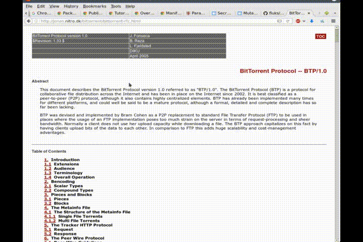

## Description

A WebExtension to mark a location on a web page and scroll to it.

## Install

<https://addons.mozilla.org/en-US/firefox/addon/mark-location/>

<https://chrome.google.com/webstore/detail/mark-location/kafbgiaafedpibbjcffhfigopjdhmabg>

## Usage

Use the browser action popup to mark a location and scroll to a saved location.
Press the number of a saved location to show a screenshot of the tab on that
location.

Or if you want to use keyboard shortcuts.

- `<Mark keyboard shortcut> + 0-9` to mark a location.
- `<Scroll keyboard shortcut> + 0-9` to go to a saved location.

